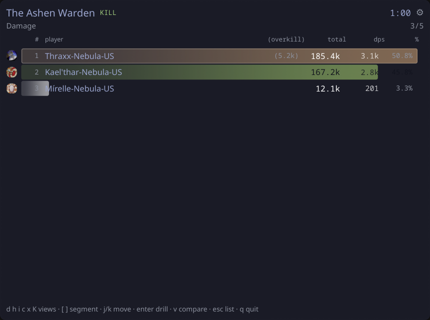
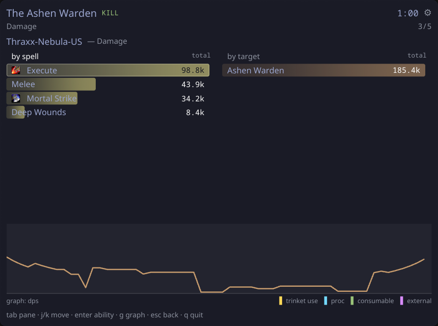
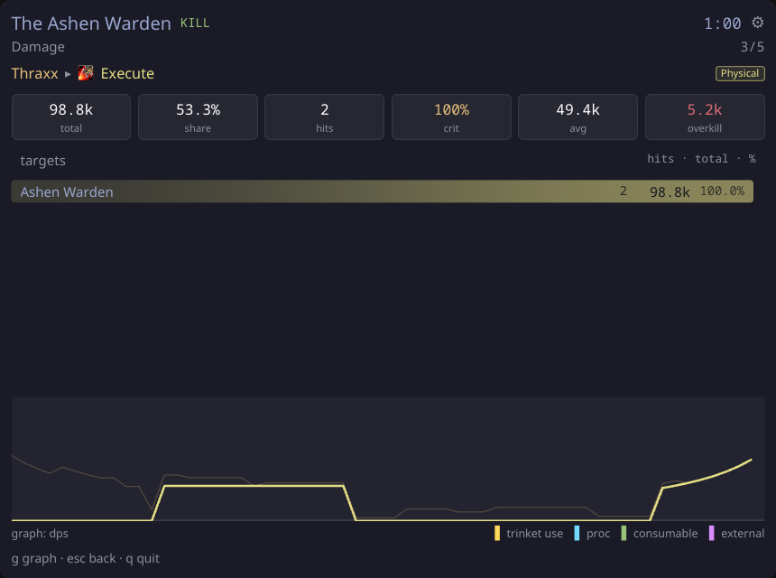
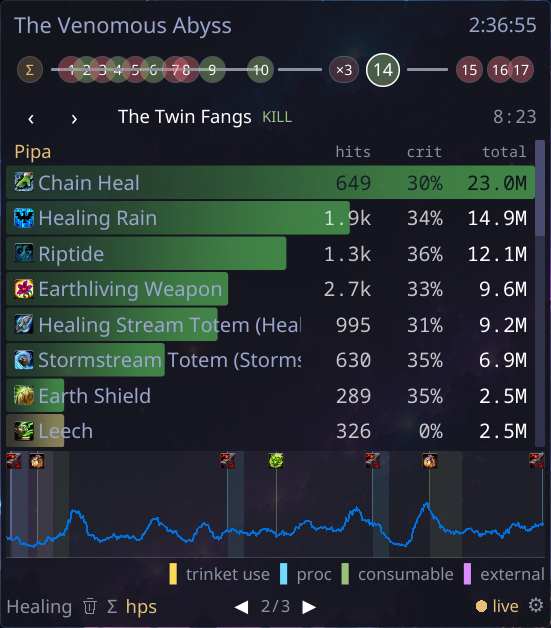
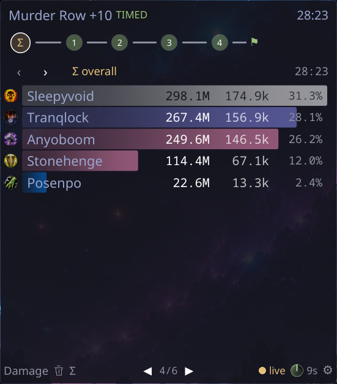
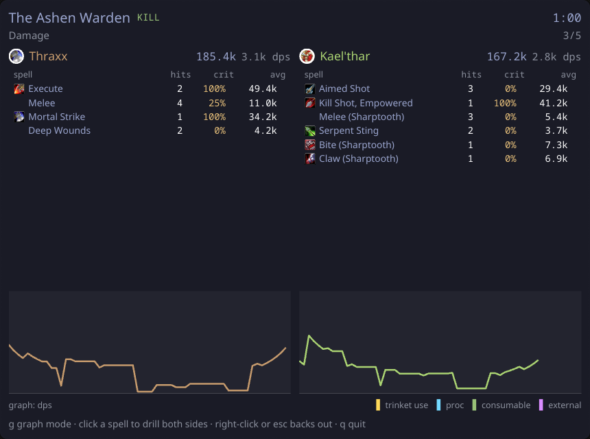

# wowdps

A World of Warcraft combat-log damage meter for Linux — a headless daemon that
tails your combat log, plus a Wayland layer-shell **overlay**, a windowed
**GUI**, and a **TUI**, all thin clients over a unix socket.

The game only writes what it sees; the meter reads `WoWCombatLog-*.txt` from
disk, entirely outside the game process. No addon, no injection, no screen
reading.

<p align="center"></p>

<p align="center">


</p>
<p align="center">


</p>
<p align="center"></p>

## What it does

- **Live meter** — damage / healing / damage-taken views, per-player, with
  class-colored rows, class crests and spec icons, updating at 10 Hz while
  you play.
- **Overlay** — a wlr-layer-shell surface (Hyprland, sway, any wlroots
  compositor) that spawns when the game starts, follows the game's workspace,
  and collapses to nothing when you hide it. Click-through where it should be.
- **Segments** — pulls are split into encounters and trash the way the game
  sees them; Mythic+ runs are grouped into instance *visits* with a Σ overall
  view, keystone par timers, and arena matches titled as wins/losses.
- **Drill-down & comparison** — per-spell breakdowns (hits / crit% / average),
  death recaps, and a two-player side-by-side with rolling-DPS or cumulative
  graphs annotated with trinket uses, procs and consumables — both panes on
  one shared scale, because per-side scaling would make every pair look
  identical.
- **Big logs, fast** — a structural index lists the segments of a 300 MB+ log
  in under a second; a segment is only fully parsed when you open it, and
  index checkpoints persist across restarts so only the tail is rescanned.
- **History** — browse every past pull in the same UI, live or not.

## Install

Rust workspace; the daemon/TUI binary is pure Rust with no non-std
dependencies and builds anywhere:

```sh
cargo build --release            # everything
cargo run --bin wowdps           # daemon + TUI, auto-discovers the install
```

On Nix, the flake packages the daemon/TUI and exports a Home Manager module
with a systemd user unit for the daemon:

```sh
nix build .#wowdps
# or in home-manager:
#   imports = [ wowdps.homeManagerModules.default ];
#   services.wowdps.enable = true;
```

Building the GUI/overlay needs Wayland-adjacent system libraries
(pkg-config, libxkbcommon at build time; wayland, vulkan-loader, libGL at
runtime) — on NixOS use the provided dev shell (`nix develop` or devenv).

## Use

```sh
wowdps                       # follow the configured/discovered logs dir
wowdps --file some-log.txt   # replay a specific log
wowdps --status              # daemon state
wowdps --stop                # stop the daemon
wowdps-gui                   # windowed client
wowdps-gui --overlay         # layer-shell overlay (the daemon spawns this
                             # automatically when the game starts)
```

The daemon spawns on demand, is shared by every client, and idles out ~10 s
after the last client disconnects. Configuration lives at
`~/.config/wowdps/config.toml` (`logs_dir`, `auto_overlay`, overlay behavior,
Hyprland workspace-following). Log discovery checks `$WOWDPS_WOW_DIR`, then
scans Steam/Proton prefixes for the newest install.

Class crests, spec icons and per-spell ability icons are extracted from your
own game install into per-machine caches under `~/.local/share/wowdps/`
(`tools/gen-icons.sh`, `tools/gen-spell-icons.sh`). Without the caches
everything still renders — you just get drawn class-colored discs and no
ability icons. Extracted game artwork is never part of this repository.

## Development

`CONTRACT.md` is the binding interface spec: parser/meter/index signatures,
the semantic rulings (what counts as damage, absorb attribution, segment
boundaries, pet attribution, class inference, …) and the wire protocol.
Fixture golden values are computed from the rulings and verified
independently of the parser:

```sh
cargo test                       # workspace: parity, IPC, fixture gates
crates/core/fixtures/verify.sh   # gawk recomputes the golden totals
cargo clippy && cargo fmt        # clippy denies panics in production code
```

Dependency policy: `model` has zero dependencies; `core`, `proto`, `daemon`
are stdlib-only. The TUI uses ratatui + crossterm; the GUI uses iced +
iced_layershell. No tokio, no chrono, no serde outside the GUI.

## Legal

This project is not affiliated with, endorsed by, or sponsored by Blizzard
Entertainment. World of Warcraft® and Blizzard Entertainment® are trademarks
or registered trademarks of Blizzard Entertainment, Inc.

The repository contains no Blizzard-owned assets. Generated tables
(`class_spells.rs`, `item_spells.rs`, `keystone_timers.rs`) hold only factual
identifiers (spell ids, class/spec mappings, dungeon timers) extracted from
the user's own local game installation. Artwork (class crests, spec and spell
icons) is likewise extracted locally into per-machine caches and is never
committed or distributed. The README's screenshots show the application
rendering fixture data; the small game icons visible in them remain
Blizzard's property and appear solely to depict the software in use.

## License

Licensed under either of

- Apache License, Version 2.0 ([LICENSE-APACHE](LICENSE-APACHE))
- MIT license ([LICENSE-MIT](LICENSE-MIT))

at your option.

Unless you explicitly state otherwise, any contribution intentionally
submitted for inclusion in the work by you, as defined in the Apache-2.0
license, shall be dual licensed as above, without any additional terms or
conditions.
