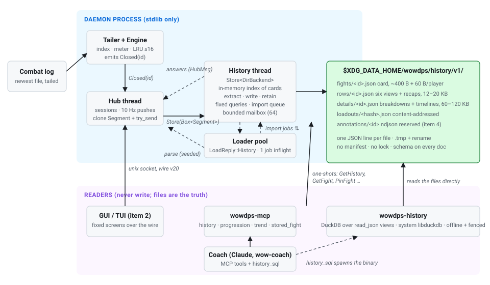
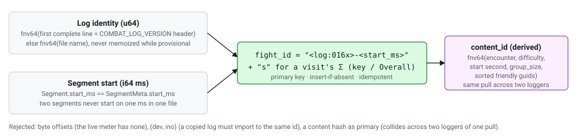
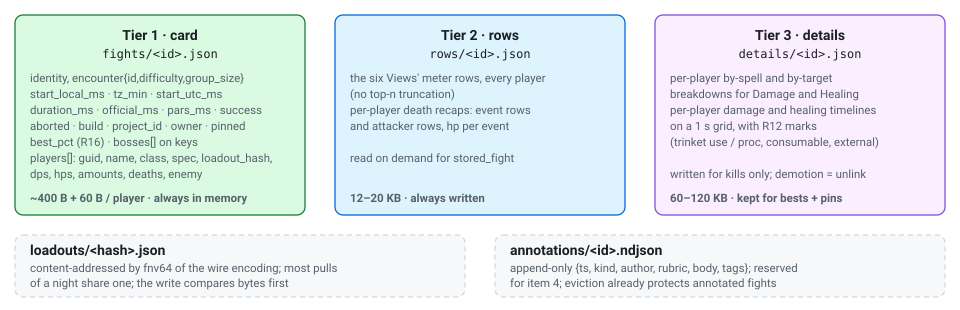
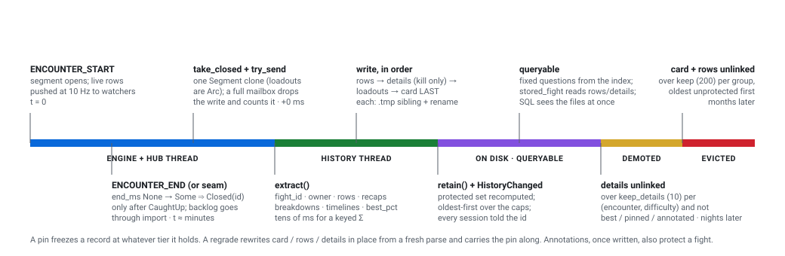
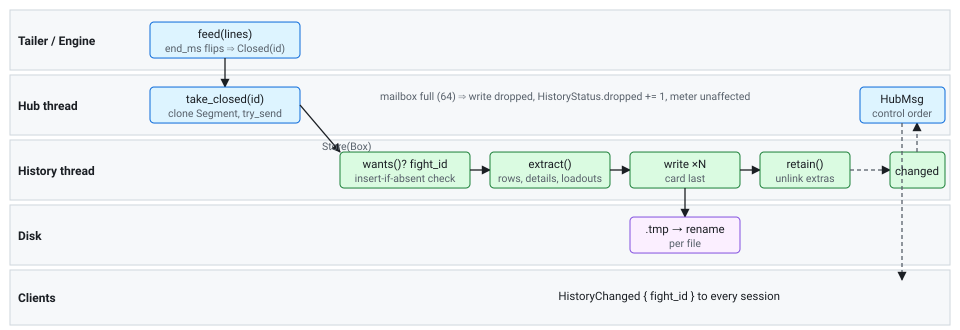
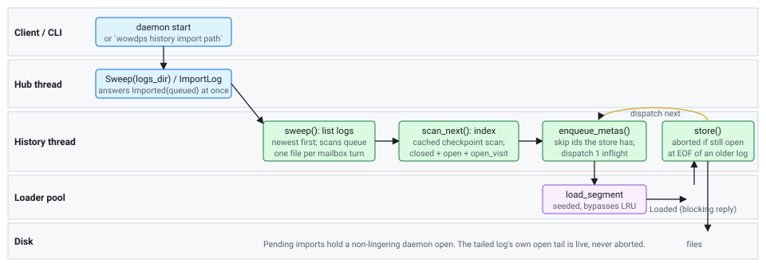
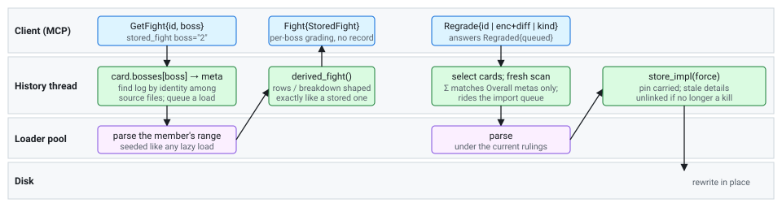
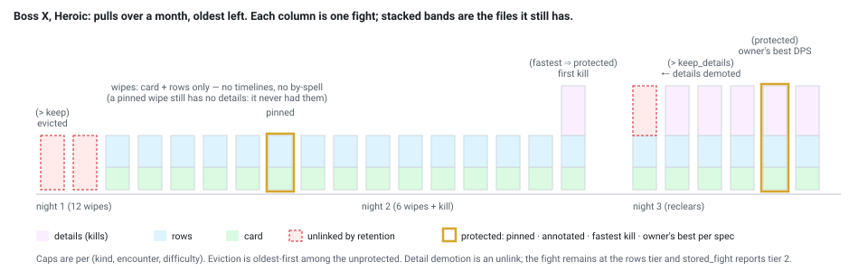
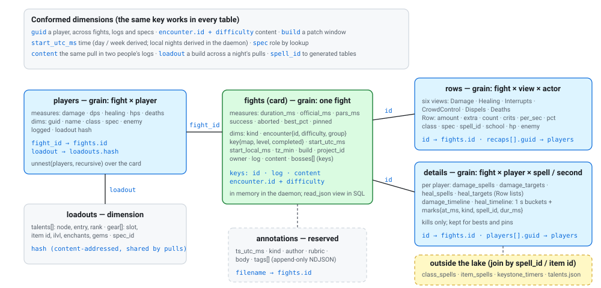
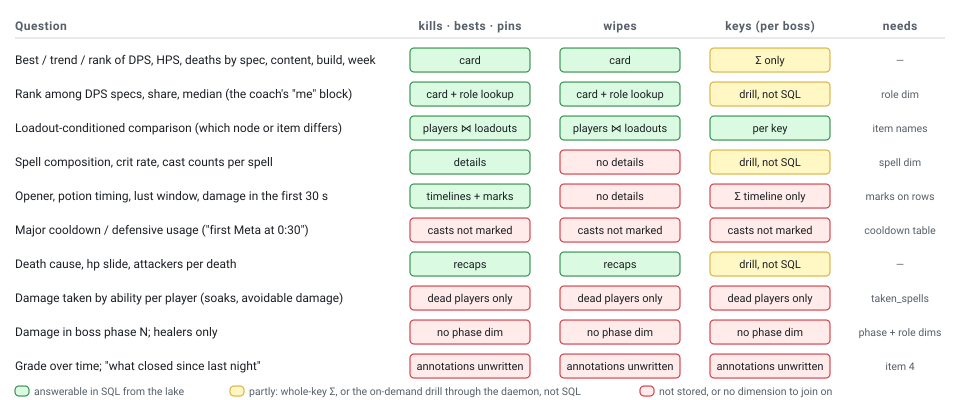

# The wowdps history store

How fights get from a live combat log onto disk, how they come back out, what keeps the store small, fast and hard to corrupt, and where it will have to grow. Describes the tree as of 2026-09-03 (branch `history-store`, PR #12, wire v20, history schema v1).

A themed standalone HTML version of this document, with the same diagrams inline, is `history-store-design.html`. The diagrams live under `assets/history-store/` in light and dark variants and switch with GitHub's theme.

1. [Why a store, and the rules it obeys](#1-why-a-store-and-the-rules-it-obeys)
2. [Architecture](#2-architecture)
3. [Fight identity](#3-fight-identity)
4. [What is stored: three tiers](#4-what-is-stored-three-tiers)
5. [Lifecycle of one fight](#5-lifecycle-of-one-fight)
6. [Swimlanes](#6-swimlanes)
7. [Retention and the protected set](#7-retention-and-the-protected-set)
8. [Retrieval: fixed questions and SQL](#8-retrieval-fixed-questions-and-sql)
9. [The analytical model](#9-the-analytical-model)
10. [Efficiency, performance, resilience](#10-efficiency-performance-resilience)
11. [Gaps and trade-offs](#11-gaps-and-trade-offs)
12. [Beyond the roadmap](#12-beyond-the-roadmap)

## 1. Why a store, and the rules it obeys

The game writes a fresh `WoWCombatLog-*.txt` per session and the daemon tails only the newest one, so before the store, history ended at the last login. The store is roadmap item 1: every closed fight becomes a small set of JSON documents under the user's data directory, and those documents outlive the log that produced them. Everything later in the roadmap (history screens, coach grades, progression graphs) sits on top of it.

Six rules shaped every decision below. They are the store's non-negotiables and the reason it looks the way it does rather than like a database.

- **Summaries, never events.** Nothing is stored that the meter cannot re-derive from the log, and nothing is keyed per event. The daemon never becomes an event store.
- **The daemon stays stdlib-only.** It writes plain files with the hand-rolled JSON value and answers the fixed questions from memory. No database engine lives in the daemon, ever.
- **The files are the truth.** Every index, cache or materialized table is rebuildable from the files and may be deleted at any time.
- **Decode never panics.** A torn, foreign or corrupt file is skipped and reported once in `Status`.
- **A live meter is never delayed.** The hub only ever `try_send`s to the history thread. A full channel drops the write and reports it.
- **Written now, impossible to retrofit.** Game build, a timezone-correct epoch and content-addressed loadouts are on every record from v1.

## 2. Architecture

The store is one thread inside the daemon plus a directory of files. Writers and readers never share a process lock: the daemon writes, and three independent readers (the daemon's own in-memory index, the DuckDB binary, and through them the MCP server and GUI) read the same files.

<picture>
  <source media="(prefers-color-scheme: dark)" srcset="assets/history-store/arch-dark.svg">
  
</picture>

Only the daemon writes. The DuckDB binary reads the same JSON files directly and needs no daemon; the MCP server asks the daemon the fixed questions and shells out to the binary for ad hoc SQL. The dashed loop between the history thread and the loader pool is the import queue: the history thread never parses a log itself.

### Why a lake of files and not a database

Three storage engines were measured before this shape was chosen. DuckDB won for analytics, but as a *reader*, not as the source of truth, for three reasons:

- **Locking.** DuckDB's file lock is one read-write process *or* N read-only. A daemon holding a database open would lock out the MCP server and the GUI. Lake files have no lock.
- **Format churn.** DuckDB 2.0 ships with a new default storage format and a reworked C API, and the Rust crate pins one minor. A database file as the truth would tie a year of the user's data to that churn. JSON does not churn.
- **Dependency policy.** The daemon cannot take the crate, and the fixed questions only need the ~400 byte cards, which stdlib Rust answers from memory in microseconds.

Measured over a synthetic lake of 5,000 fights: DuckDB answers a best-kill group-by across 5,000 separate JSON files in 0.5 s including process start, a weekly trend join in 0.44 s, and 35 ms once materialized. Idle RSS is 36 MB. SQLite (the fallback) answers the trend in 0.11 s without an index and 15.7 s with the wrong one, which is the planner hand-holding the lake avoids.

## 3. Fight identity

Every record is keyed by a fight id that can be recomputed from the log alone, so restarts, rescans and replays of a stored log produce the same id and therefore write nothing.

<picture>
  <source media="(prefers-color-scheme: dark)" srcset="assets/history-store/ids-dark.svg">
  
</picture>

The Σ mark exists because a visit and its first member can share a millisecond. The log identity is computed lazily at first store rather than when the tailer switches files, because a brand-new log may hold half a line at that moment.

A record is rewritten in exactly three cases: its schema is older than the daemon's; it was *aborted* and the same fight later closes for real (its END arriving after a restart); or a `Regrade` asked for it. Every rewrite carries `pinned` forward, and annotations live in separate files that a rewrite never touches.

## 4. What is stored: three tiers

A fight is three files, in tiers of decreasing permanence. The card is tiny and always kept within retention; the rows are always written; the details are written only for kills and thereafter survive only as bests and pins. Loadouts are side records shared across fights.

<picture>
  <source media="(prefers-color-scheme: dark)" srcset="assets/history-store/tiers-dark.svg">
  
</picture>

The denormalized top-line numbers on the card's player rows are what let trend and best-per-player queries run without ever opening a rows file. A fight's *tier* is simply which files exist, so a reader learns what it could not be served rather than receiving a partial document.

**What is deliberately excluded:** raw events, spell-of-a-spell timelines and spell target lists (derivable by reopening the log while it exists), compare windows (computed from stored by-spell rows), anything about players not in the fight. Rates and percentages are stored as computed, never recomputed downstream. Budget: 5,000 fights is roughly 100 MB of cards and rows, and details are capped by retention.

| Kind of segment | Stored as | Notes |
| --- | --- | --- |
| Raid boss (Encounter) | One pull record | Aborted (no ENCOUNTER_END) stored with `success: null`, `aborted: true`; listed but never a pull. |
| Arena match (R13) | One record, WIN / LOSS | Enemy rows kept. |
| Keyed visit (Mythic+) | The visit's Σ, with `bosses[]` | Members are never their own pulls, even when the key's START predates the log (difficulty 8 marks it). Per-boss numbers come from the on-demand drill. An abandoned key is aborted; its duration is combat time to the last hit. |
| Plain visit (raid night) | The visit's Σ | Stored whether or not the visit ever closed: zoning out only suspends a visit, so the night's raid is still open at EOF. |
| Trash | Only under `history_store_trash` | Off by default. |
| Noise | Never | |

## 5. Lifecycle of one fight

From the first line of an encounter to a queryable record, and on to demotion and eviction. Times are illustrative; the point is which thread owns each step and where the irreversible boundaries are.

<picture>
  <source media="(prefers-color-scheme: dark)" srcset="assets/history-store/lifecycle-dark.svg">
  
</picture>

The card is written last on purpose: a reader that lists `fights/` and finds a card is guaranteed the rows exist, and a crash between writes leaves at most an orphan rows file, never a card without its rows.

### Detection details that matter

- **Only live closes reach the store thread through the hub.** Backlog replay before `CaughtUp` emits nothing; the tailed log's index is handed to the history thread instead, which enqueues whatever it holds that the store lacks as import jobs. That is what makes a restart mid-night idempotent.
- **A Σ closing without its prefix resident.** If the daemon attached mid-visit and nobody watched the Σ (or the LRU evicted it), the hub requests a prefix load and stores the fight when it lands, tracked in `history_pending`, rather than dropping the key.
- **A suspended visit reads live only while the game runs.** Zoning out suspends a visit (R10). Its Σ row stays live while a member is fought, the game runs, or lines arrive, so a stale log's last key is not shown as a fight happening now.

## 6. Swimlanes

### 6a. Live close

<picture>
  <source media="(prefers-color-scheme: dark)" srcset="assets/history-store/swim-live-dark.svg">
  
</picture>

The hub's whole contribution is a clone and a non-blocking send. Row, recap, breakdown and timeline computation all happen on the history thread, which is why a keyed Σ with twenty timelines costs the live meter nothing.

### 6b. Start-up import and on-demand import

<picture>
  <source media="(prefers-color-scheme: dark)" srcset="assets/history-store/swim-import-dark.svg">
  
</picture>

Import is deliberately serialized: one file scanned per mailbox turn so a directory of gigabytes never holds queries out, and one parse job in flight so a watching client always finds a loader worker free. The reply from the pool is the one blocking send in the whole path, because a lost `Loaded` would wedge the queue.

### 6c. On-demand boss drill and regrade

<picture>
  <source media="(prefers-color-scheme: dark)" srcset="assets/history-store/swim-drill-dark.svg">
  
</picture>

Both paths reuse the loader pool and the seeded lazy-parse machinery, so a key member's numbers or a regraded card are derived by exactly the same code as a live parse. That is what keeps "per-boss grading without per-boss records" honest.

## 7. Retention and the protected set

Retention runs on the history thread after every write. It is count-based per *group*, where a group is (kind, encounter id, difficulty), and it never touches the protected set, which is recomputed at eviction time from the cards in memory.

| Config key (flat, in config.toml) | Default | Meaning |
| --- | --- | --- |
| `history_enabled` | true | Write at all. Disabled answers every query empty; `Status` says why. |
| `history_dir` | XDG | Override the lake root. The DuckDB binary reads the same key, so SQL always sees the lake the daemon writes. |
| `history_store_trash` | false | Also store trash segments and a key's members as their own records. |
| `history_keep_per_encounter` | 200 | Cards and rows kept per group. Over the cap, the oldest unprotected fights are unlinked (details, rows, card). |
| `history_keep_details_per_encounter` | 10 | Details kept per group. Over the cap, the oldest unprotected details are unlinked; the card and rows stay. |
| `history_characters` | "" | "Name-Realm, …" that are the owner. Empty means inferred (section 8). |

<picture>
  <source media="(prefers-color-scheme: dark)" srcset="assets/history-store/night-dark.svg">
  
</picture>

The important asymmetry: a wipe never has details, because they are written only on a kill. Pinning a wipe protects its card and rows from eviction but cannot conjure the timelines that were never written. Section 11 returns to this.

## 8. Retrieval: fixed questions and SQL

Two readers, one truth. The daemon answers a small set of **fixed questions** from its in-memory card index over the wire. The DuckDB binary answers **anything** in SQL over the same files. A parity test keeps the two honest: the daemon's Fights, Progression and Trend answers over the fixture must equal SQL's over the files the same run wrote.

### Fixed questions (wire v20)

| Message | Question | Answered from |
| --- | --- | --- |
| `GetHistory Fights` | Filter by encounter, difficulty, guid, since, kind; sort Newest / Fastest / OwnerPerSec; page with `after_id`, answer carries `total`. | Cards only. Best kill is Fastest with limit 1; key times are kind Key. Owner stamped at answer time. |
| `GetHistory Progression` | Pulls, kills, first kill, per-night pulls / kill / best_pct / kills, median kill time; nights by UTC day or by each card's own local day with a cutover hour. | Cards only. |
| `GetHistory Trend` | Per player + spec, per view, bucketed None / Day / Week, scoped by encounter, difficulty and since. | Cards only (the denormalized per_sec on player rows). |
| `GetFight` | One stored fight for a view and optional drill; with `boss`, a key member parsed from the log on demand. | Card + rows (+ details) read from disk; reports `tier` and `has_recap`. |
| `PinFight` | Flip the one in-place card edit. | Rewrites the card. |
| `ImportLog`, `Regrade` | Queue work; answered with a count before any file is read. | The import queue. |
| `HistoryChanged` | Unsolicited on every store, like `SegmentList`. | |

All are one-shots: always answered, never an error, and a disabled store answers empty. Nothing about a stored fight is watchable through a `Cursor`, because a stored fight never changes. The MCP tools wrap these one to one and add reader-side sugar: the owner's row as `me` with rank, count, median and share among DPS-role players, a named player as `peer`, difficulty names, local nights, hero tree names.

### SQL over the lake

```sh
wowdps history sql "select name, duration_ms from fights order by start_utc_ms desc"
wowdps history sql "select p.name, avg(p.dps) from players p where p.guid = ? group by 1" --params '["Player-..."]'
wowdps history best-kill 3130 15
wowdps history materialize      # cache.duckdb, opened only by this binary
```

The binary defines views `fights`, `players` (the card's players unnested), `rows`, `details`, `loadouts` and `annotations` over `read_json` globs. It opens with two threads and a 256 MB memory limit, extension autoload off and the extension directory pointed inside the lake, so the engine never reaches the network. A *reading* lake additionally fences file access to its own five directories and locks the configuration, because the MCP tool hands an LLM's SQL to it verbatim and without the fence `COPY … TO` could write anywhere on the machine. Queries take bound parameters so a string literal never crosses a quoting layer.

### Who is "me"

`history_characters` is the source of truth. When empty, the owner is the intersection of COMBATANT_INFO guids across *all* stored logs: the logger is in every log they write, guildmates are not. It is never inferred per log and never from meter rows, because the row builder drops zero-output actors and a logger who died early would vanish from a per-log intersection. `Status` marks an inferred owner, and `Fights` stamps the owner at answer time so cards written before the key was set still name them.

## 9. The analytical model

There is no cube. What the lake holds is a small star-shaped document model whose grain is the fight, with one pre-flattened fact set per level of detail. The card is the wide fact row; everything else hangs off its id. This section lists what is measured, at which grain, along which dimensions, and which joins are possible.

<picture>
  <source media="(prefers-color-scheme: dark)" srcset="assets/history-store/star-dark.svg">
  
</picture>

Solid lines are joins the views support today. Dashed lines are a reserved table and the per-machine tables that live outside the lake. The card is deliberately wide so the daemon's fixed questions and most SQL never leave it.

### Measures by grain

| Grain | Where | Measures |
| --- | --- | --- |
| Fight | `fights` | duration, official key time, par timers, success, aborted, best boss percent, pinned |
| Fight × player | `players` | damage, DPS, healing, HPS, deaths. Denormalized from the rows so trend and best-per-player never open a rows file. |
| Fight × view × actor | `rows` | amount, extra (overheal or absorbed), hit count, crit count, per-second rate, share of the total, hp at the event |
| Fight × player × spell, and × target | `details` | the same Row measures, split for Damage and Healing |
| Fight × player × second | `details` timelines | damage or healing per 1 s bucket, plus marks with a time, kind (trinket use, trinket proc, consumable, external), spell id and duration |
| Fight × dead player × event | `rows` recaps | the death's event rows and attacker rows, hp per event |

### Dimensions

- **Time.** Local start, UTC start, and the log's timezone offset. Day and week buckets are derived; local nights with a cutover hour are derived in the daemon only.
- **Content.** Kind (Encounter, Arena, Key, Overall), encounter id, difficulty, group size, key map, level and completed flag, the bosses inside a key.
- **Actor.** Guid, name, class, spec, enemy side, logged flag, and the owner flag stamped on the card.
- **Build.** The game build triple, project id and log version, on every record from v1.
- **Loadout.** A content hash on each player row, resolving to talents and gear by slot.
- **Provenance.** Log identity, content id, byte range.

### How it is organized

The card is the whole "cube": one wide row per fight and, through the players view, one wide row per fight-player, sliced by encounter, difficulty, guid, spec, kind and time. Rows and details are per-fight documents whose inner lists stay nested; SQL unnests them per query, and nothing has pre-shaped them into fact tables. Loadouts are a content-addressed dimension table. Annotations are a reserved fact table keyed by fight id and time.

### The DuckDB features doing the work

- **Schema-on-read over JSON globs** with type inference and `union_by_name`, which is what lets the lake add fields within schema v1 with no migration: older files show nulls in the new columns. The annotations view reads newline-delimited files with `filename = true` so every line knows its fight.
- **Nested types.** The card's encounter arrives as a struct, so queries filter on `encounter.id` directly, and the players array is flattened with a recursive `unnest`.
- **Ordinary OLAP SQL on top.** The built-in subcommands are group-bys and ordered limits: best kill is an ordered limit 1, progression is integer-division day bucketing with a count and a `bool_or`, trend is a filtered ordered scan of the players view. The value is that ad hoc SQL through the MCP tool gets the full engine, including window functions and quantiles, which the daemon's fixed questions do not offer.
- **Bound parameters** for every placeholder, and **ATTACH** plus create-table-as-select for `materialize`, which turns a JSON re-parse per query into a columnar scan.
- **Linked but unused:** Parquet (the natural format for cold rollups) and ICU (timezone-aware bucketing, so SQL could match the daemon's local nights instead of bucketing by UTC integer division).

### What can be asked today, and what cannot

<picture>
  <source media="(prefers-color-scheme: dark)" srcset="assets/history-store/coverage-dark.svg">
  
</picture>

The pattern in the matrix is the retention asymmetry from section 7: the card answers the same questions for every fight, and everything below the card only for kills, bests and pins. The "needs" column is the store change that would turn a red cell green. Every row is a DPS-role question; healer and tank questions are tabled below under roadmap item 1a.

### Advanced queries that work now

- Any pivot of fight-player measures over content, difficulty, spec, build and time, with windows and quantiles: rank per pull among DPS specs, rolling best over the last N kills, per-spec medians per week, DPS before versus after a build.
- Loadout-conditioned comparison: group the owner's pulls by loadout hash, then unnest talents or gear to find which single node or item differs between the better and worse groups.
- Spell and target composition on kills, bests and pins by unnesting details, including crit rate and cast counts per spell across a progression.
- Timeline questions on stored kills: damage in the first 30 s, damage inside a lust window, gaps between marks.

### What blocks harder questions

- **Timeline and spell facts exist only for kills.** Wipes have no details, so opener or potion analysis across a progression night is impossible in SQL. This is the same gap section 11 ranks first.
- **No spell or item dimension inside the lake.** Spell ids resolve to names only through row labels, item ids not at all. Joining to the generated tables means exporting them as CSV or Parquet beside the lake.
- **No boss-level facts for keys.** A key is one row. Per-boss numbers come from the on-demand drill, which SQL cannot call.
- **The time dimension is raw milliseconds.** Local nights, weeks and patch windows are recomputed per query. A small generated days or builds dimension, or ICU timestamps in the views, would make those joins declarative.
- **No phase or role dimensions.** Rows carry class and spec but not role, and nothing records boss phases, so "damage in phase 2" and "healers only" need reader-side lookup tables.
- **Nested lists are unnested per query.** At tens of thousands of fights the details view becomes the expensive part. Materializing pre-unnested spell, target and timeline fact tables through `materialize` would turn the lake into a real star schema without changing what the daemon writes.

### Role pivots: healers and tanks (roadmap item 1a)

Every ranking and grade above is a DPS-role number. Healers want effectiveness (overhealing, wasted absorbs, absorbs given, externals given and received, buff uptime) and a rank among healers. Tanks want damage taken by ability, mitigation, active-mitigation uptime, self-healing, and who the boss was hitting. The store serves about half of the healer list and almost none of the tank list, and the tank half is a parser gap rather than a storage gap. Roadmap item 1a (`roadmap.md`) is the follow-on project; this table is where each measure stands today.

| Want | Held today | Where | Gap |
| --- | --- | --- | --- |
| Effective healing, overheal | every fight | Healing view: amount is effective, `extra` is overheal (R2) | None. A SQL ratio over the rows view. |
| Absorbs given | folded | SPELL_ABSORBED credits the absorber as healing (R3); split per shield spell only in details | Not separable on the card or rows tier. |
| Wasted absorbs | no | Nothing tracks a shield's applied value against what was consumed | Parser state: pair aura applied (with its absorb amount) to consumed and removed. |
| Healing received per player | dead only | R9 recap ring, 32 events | No per-player taken grain. |
| Healer rank, share, median | no | The MCP grades among DPS-role players; role is a reader-side spec lookup | Role on the card's player rows. |
| Externals given and received | partial | Bloodlust family and Power Infusion as timeline marks, receiver only, kills only | A defensive-external table with caster and target. |
| Buff and mitigation uptime | no | Nothing stores aura spans | Aura spans for a curated set. |
| Damage taken by ability | dead only | Recap ring | A per-player Taken grain on the rows tier. |
| Block, dodge, parry, miss | no | SWING_MISSED and SPELL_MISSED fall into `Event::Other`; partial blocks on damage lines are dropped | Parser events plus a new View and ruling. |
| Absorbs consumed on a tank | healer side | R3 puts the amount on the absorber | The Taken grain carries `absorbed`. |
| Stagger, cheat death | excluded | Four self-absorbs are dropped from healing on purpose | The Taken grain keeps them as mitigation. |
| Self-healing | kills only | Details heal targets where target equals source | A rows-tier column. |
| Threat, boss target | not in the log | | Proxy: boss-sourced damage per player from the Taken grain plus R16's boss identity. |

**How it maps into the model.** Five additions, each shippable alone and listed in the order the roadmap item proposes:

1. **A role dimension** on the card's player rows, stamped at write time from the spec and back-filled by regrade, so the daemon's grades and SQL agree and the coach's `me` block can rank among same-role players.
2. **A Taken grain on the rows tier for every fight:** fight × player × source spell with amount, absorbed, blocked, overkill, count and miss counts by type. Tank mitigation, soaks and item 2's avoidable-damage markers all read it. It is the spec's damage-taken refinement promoted from details to rows, because wipes are where tanks die.
3. **A healing split on the card:** absorbed and overheal per player, so effectiveness and absorb share become card-only queries like the DPS trend.
4. **Aura spans with caster and target** from a generated per-spec table of active mitigation, personal defensives and healer externals, stored as timeline marks with their duration and a source guid. "Externals given" is then a group-by over marks by source, and uptime is a sum of durations. This is the cooldown-mark refinement widened to support roles.
5. **Wasted absorbs,** the one item needing new parser state, deferred until the Taken grain exists.

Miss events and partial blocks are new parser events, so CONTRACT gains a ruling for Taken with fixture expectations; none of these open a segment, so the scanner is untouched. The new View is a wire-shape change and therefore a `PROTO_VERSION` bump.

## 10. Efficiency, performance, resilience

- **Hot path is a clone and a try_send.** The hub thread does no history work beyond cloning the closed segment (loadouts are shared by `Arc`) and a non-blocking send into a mailbox of 64. Extraction, serialization, writes and retention run elsewhere. The 10 Hz push cadence is unaffected even when the mailbox is full.
- **Index rebuilt from cards, in memory.** There is no manifest. Start-up reads every card (5,000 × 400 B, milliseconds) into a start-sorted `Vec` with by-encounter, by-key and by-guid maps. Every fixed question is answered under 20 ms in release over 5,000 cards, without opening a rows file.
- **Denormalization where it pays.** Top-line DPS / HPS per player on the card is a deliberate copy of what the rows hold, so trend and best-per-player never read tier 2. Everything else is normalized (loadouts are content-addressed and shared).
- **Import never starves a live client.** One log scanned per mailbox turn; one parse job in flight through the loader pool; loads reply as `LoadReply::History` and bypass the engine's LRU, so a client browsing history does not evict a watcher's segment. Index checkpoints from the cache make each rescan touch only a log's tail.
- **Atomic files, card last.** Every document goes to a uniquely named `.tmp` sibling and is renamed into place, so a reader never sees a partial file and DuckDB never needs `ignore_errors`. Within a fight, the card is written last: a card's existence implies its rows exist.
- **Idempotent by construction.** Insert-if-absent on a recomputable id. Restart mid-fight, rescan, a CRLF copy of a log, or replaying a stored log with `--file` all write nothing. An aborted record is provisional and is replaced when the real END lands.
- **Fail soft, report once.** A corrupt or foreign card is skipped and counted; an unwritable directory or ENOSPC fails the write, sets `last_error`, and the daemon lives. The store's status (fights, dropped, importing, owner inferred, error) rides in every `Status`.
- **Schema on every document.** `HISTORY_SCHEMA` is independent of `PROTO_VERSION`. Within `v1/` fields are only added and readers tolerate missing ones (fuzz: truncation at every byte never panics). A breaking change is `v2/` plus a one-shot migrator; never an in-place edit.
- **Rulings can change; records follow.** Because the log is the source and the id is recomputable, `regrade` rewrites any card under the current rulings (R16 was refined three times on real logs this way), keeping pins and never touching annotations.
- **Readers are sandboxed and offline.** The DuckDB reader cannot reach the network, cannot read or write outside the lake, and never shares a database file with another process. The materialized cache is opened only by the binary that wrote it.
- **Generic store, two backends.** `Store<B: Backend>` runs over a directory in production and over an in-memory map in the daemon mock and tests, so every retention and protected-set rule is unit-tested synchronously and the GUI's history screens render headless.
- **Parity gates.** The lake parity test (daemon answers = SQL answers), `stored_fight` byte-equal to `fight` over the fixture, the ignored real-log perf gate, and a production suite that sandboxes `XDG_DATA_HOME` so a test sweep can never import into the user's real store again.

## 11. Gaps and trade-offs

Each of these is a consequence of a rule in section 1 or a decision in section 2, not an oversight. They are listed with what would have to change to close them and which roadmap item pushes on them.

> **Wipes lose their timelines and marks.** Details are written on kills only, so potion timing, lust alignment and the opener are gradable forever on a kill and never on a wipe, even a pinned one. The coach's most repeated finding ("first Meta at 0:30, peers burst at 0:10") was computed by re-reading the log. *Fix:* a per-player mark list plus a coarse 10 s damage series on the rows tier (a few hundred bytes per player); the 1 s grids stay in details. Schema stays v1. This is the top-ranked refinement in the spec's section 14 and roadmap item 4 depends on it.

> **Marks cover items and consumables, not class cooldowns.** Casts are deliberately not a mark source (R12), so major cooldowns and personal defensives are invisible on stored timelines. *Fix:* generated per-spec tables (base cooldown ≥ 60 s, or the spec's known burst window) feeding two new `MarkKind`s through the same lookup path as item spells; regenerated per patch like `class_spells.rs`. Roadmap item 2's cooldown bars and item 4's opener findings both want this.

> **Annotations are reserved, not written.** The file, the codec and the eviction rule exist; nothing writes them. The coach's grades and retractions live in its session memory, so "what closed since last time" is a memory lookup rather than a query. *Fix:* an `Annotate` message and `grade_fight` / `note` MCP tools (item 4). Design question still open: an append-only NDJSON per fight is simple and rename-atomic per line, but a grade that is revised needs a "latest wins" read rule, and a note against a *character* rather than a fight has no file yet.

> **Retention is count-based, per group, with no size budget.** Two hundred cards and rows per (encounter, difficulty) is generous for a raid tier and meaningless for keys, where every dungeon and level is its own group and a season of pushing accumulates freely. There is no global byte cap and no age cap. *Trade-off accepted:* counts are predictable and a user's disk is large; but a settings page (item 3) that shows "history is using N MB" will want `stats` to be cheap and a total budget to exist.

> **The in-memory index scales linearly.** Every card is resident and most queries scan the vector, filtered by the by-encounter and by-guid maps. At 5,000 fights this is microseconds; at 50,000 (several seasons of keys with trash on) it is still fast, but Progression and Trend will want the cards pre-bucketed. Nothing forces a change before item 2's history graphs poll these at frame rate.

> **Per-fight files and DuckDB's glob.** Five thousand small files cost DuckDB nothing measurable; fifty thousand will, because `read_json` re-reads every file on every query (which is also why the fence has to be a directory allowlist rather than "no external access"). `materialize` is the escape hatch and is manual. A background materialize triggered by `HistoryChanged`, or monthly NDJSON rollups of cards older than the retention horizon, are both compatible with "the files are the truth".

> **The daemon's config is read once.** Changing any `history_*` key needs a restart. Item 3 reserves `ReloadConfig`; when it lands, retention caps applying live is the easy part, and a changed `history_dir` is the hard part (re-open the store, re-sweep, and decide what the old directory is).

> **Loadouts are keyed by wire-encoding hash and never evicted.** Content addressing shares a night's builds, but a loadout whose every fight has been evicted is an orphan nobody removes. Harmless at kilobytes each; a sweep that unlinks unreferenced hashes is a small addition to `retain` and should wait until an annotation can reference a loadout.

> **The log is needed for anything the record does not hold.** The boss drill, regrade, and anything a future tool derives on demand all find the log by identity among the source's files. Once the game rotates the log away, a key's per-boss numbers are gone with it. The spec accepts this ("derive by reopening the log while it exists"); item 2's per-boss key screens may want the drill to write a derived record on first request, tiered like the rest.

> **Names are inline; there is no redaction.** Row labels and player rows carry every raid member's name, from the user's own log, on the user's own disk. The spec places redaction on the export path. Any sharing feature (roadmap item 2's share/export, a future upload) must rewrite labels and hash guids before bytes leave the machine.

> **Healer and tank questions are mostly unanswerable.** Overheal and effective healing are on every fight, but absorbs are folded into healing, externals are receiver-only marks on kills, and nothing on the tank side is modeled: miss and block events are unparsed, damage taken exists only for the dead, and no role dimension exists. Roadmap item 1a (section 9, role pivots) is the follow-on project: a role on the card, a Taken grain on the rows tier, a healing split on the card, aura spans with caster and target, then wasted absorbs.

> **Two smaller data gaps** the coach's first report hit: gear rows carry item ids without names (needs a per-machine item-names cache from ItemSparse, same generator family as the icon caches), and `difficulty_name` is a hand table with at least one unnamed id (needs Difficulty.db2 through the extractor). Neither touches the store's schema.

## 12. Beyond the roadmap

Speculation, in roughly increasing distance from what exists. Every item respects the same rules: summaries only, the daemon stays stdlib, the files stay the truth.

- **Per-boss records for keys, on demand.** Today a key's members are derived from the log when asked. Storing the derived record the first time it is requested (a fourth tier, evicted first) would make key progression per boss survive log rotation and give item 2 a screen without a parse per click.
- **Derived views as first-class files.** A `loadout_diff` between two fights, a night summary, a "what closed" ledger: each is a pure function of stored files and could be written as a cached document under `derived/`, invalidated by `HistoryChanged`. The lake absorbs new directories without a schema bump.
- **Cold rollups.** Cards older than a season concatenated into monthly NDJSON and optionally Parquet through the DuckDB binary. The daemon keeps reading per-fight cards for its index; the rollup is for SQL over years. Parquet is the first place a second file format would enter the lake, and it should stay a cache of JSON, never the truth.
- **Encounter and class knowledge as data.** Boss phase boundaries (from ENCOUNTER events and known spell ids), avoidable-damage tables, major-cooldown tables: all generated from the client's DB2 files per patch, all consulted at extraction time to mark timelines. The store then carries the marks, and the knowledge never has to be re-derived by a reader.
- **A grade trend as a query.** Once annotations are written with a rubric and a score, "how has my Meta opener graded over the last ten pulls" is a Trend over annotations instead of cards, and the GUI's coach pane is a chart over it.
- **Sharing without an upload service.** The store already computes a cross-logger `content_id`. Two guildmates' lakes could be merged offline by that id (an `export` with redaction plus an `import` that stores foreign cards under a separate owner) and compared in SQL. That is the extent of "multi-user" the non-negotiables allow; a hosted event store remains explicitly not planned.
- **Windows.** The store is the most portable part of the daemon: plain files, no unix socket in its own path, no `/proc`. If roadmap item 5 happens, the history store and the DuckDB reader port for free; the sweep's log discovery and the game-process liveness signal are what change.
- **Schema v2.** The likely trigger is not a field but a key: if fight identity ever has to change (the game altering its header line, or a per-character store), the migrator the spec reserves is the path. Everything else the store will need in the foreseeable future is an added field.

Sources: `spec-history-store.md` (the binding design, sections 1 to 14), `roadmap.md`, CONTRACT.md's daemon and wire sections, and the tree at `crates/daemon/src/history.rs`, `crates/proto/src/history.rs`, `crates/history/`. Sizes and timings are the spec's measurements on the author's machine.
